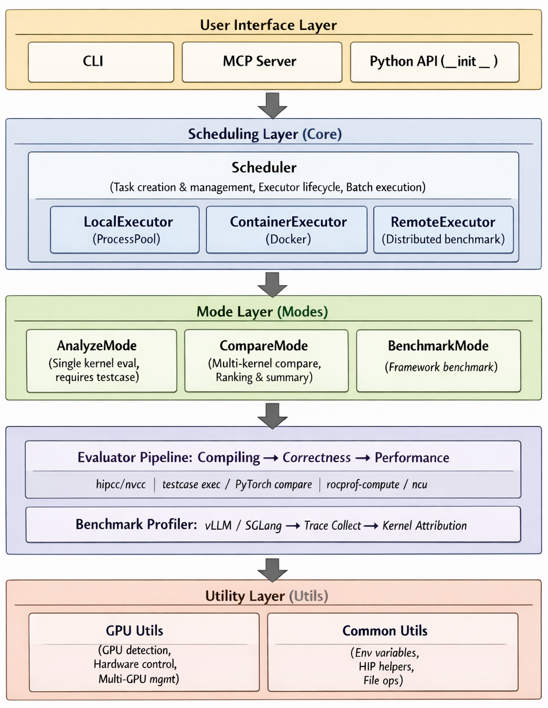
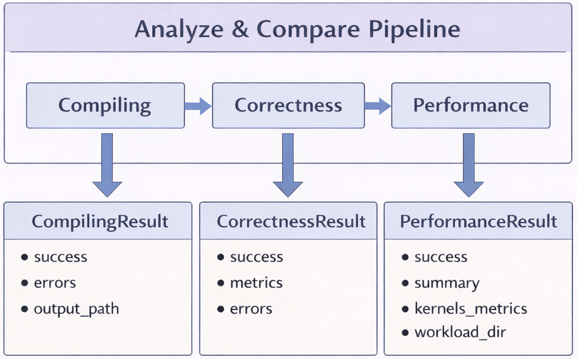
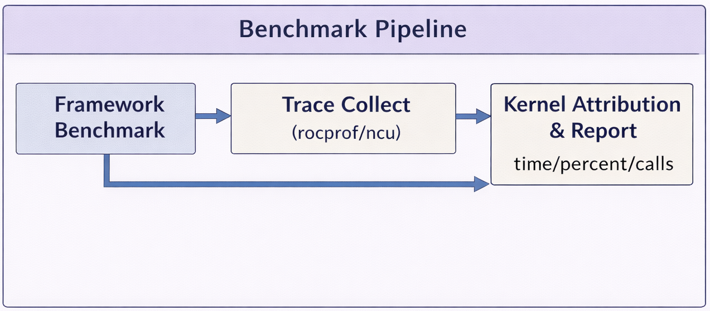

# Magpie

A lightweight, general-purpose framework for evaluating GPU kernel correctness and performance.

## Features

- **Three Evaluation Modes**: Analyze, Compare, Benchmark
- **Heterogeneous Hardware**: AMD (HIP) and NVIDIA (CUDA) GPUs
- **Execution Environments**: Local, Sandbox Container, and Remote Ray Cluster
- **Hardware Control**: Hardware-aware kernel evaluation under controlled execution settings
- **Trace Analysis**: TraceLens integration for performance profiling analysis
- **MCP Server**: Model Context Protocol integration for AI agents
- **Structured Reports**: JSON output for pipeline integration

## Requirements

- Python 3.10+
- AMD ROCm (HIP) or NVIDIA CUDA toolchain (for kernel compilation/profiling)
- `rocprof-compute` (AMD) or `ncu` (NVIDIA) if you enable performance profiling
- Docker (default for Benchmark mode when `run_mode` is `docker`; host execution uses `run_mode: local`)

## Installation

### From GitHub (Recommended)

```bash
# Basic installation
pip install git+https://github.com/AMD-AGI/Magpie.git

```

### From Source (Development)

```bash
git clone https://github.com/AMD-AGI/Magpie.git
cd Magpie

# Editable install (recommended for development)
pip install -e .

# Or use make
make install
```

## Quick Start

```bash
# Analyze a kernel using a config file
magpie analyze --kernel-config Magpie/kernel_config.yaml.example

# Compare kernels using a config file
magpie compare --kernel-config examples/ck_grouped_gemm_compare.yaml

# Benchmark vLLM (see examples/benchmarks/*.yaml)
magpie benchmark --benchmark-config examples/benchmarks/benchmark_vllm_dsr1.yaml

# GPU / toolchain summary
magpie --gpu-info

# Run MCP server
python -m Magpie.mcp
```

> **Note:** You can use `python -m Magpie` instead of the `magpie` CLI for the same subcommands.

## Evaluation Modes

| Mode | Description | Status |
|------|-------------|--------|
| **Analyze** | Single kernel evaluation with testcase | ✅ |
| **Compare** | Multi-kernel comparison and ranking | ✅ |
| **Benchmark** | Framework-level benchmarking (vLLM/SGLang) with trace analysis | ✅ |

> 📖 See [Benchmark mode](docs/benchmark.md) for vLLM/SGLang usage.  
> 📖 See [Analyze vs Compare](docs/analysis_compare.md) for kernel evaluation modes.

## Configuration

### Framework Config (`Magpie/config.yaml`)

Key categories:
- `gpu`: device selection and hardware control (power/frequency).
- `scheduler`: local, container, or Ray execution and worker settings.
- `compiling` / `correctness`: default compile behavior, testcase vs Accordo, tolerances.
- `performance`: profiler backend (rocprof-compute, ncu, Metrix), timeouts, metric blocks.
- `compare`: perf metric weights and winner selection for compare mode.
- `benchmark`: InferenceX path, image mapping, default profiler flags.
- `logging`: log levels and optional file output.

### Kernel Config

See [`Magpie/kernel_config.yaml.example`](./Magpie/kernel_config.yaml.example) for full examples.

### Example Configs

Example configs live in `examples/`:

| Mode | Config File | Description |
|------|-------------|-------------|
| Analyze | `examples/ck_gemm_add.yaml` | Single kernel evaluation |
| Analyze | `examples/simple_hip_test/analyze_default.yaml` | Minimal HIP example |
| Compare | `examples/ck_grouped_gemm_compare.yaml` | Multi-kernel comparison |
| Benchmark | `examples/benchmarks/benchmark_vllm_dsr1.yaml` | vLLM (DeepSeek-R1-style) |
| Benchmark | `examples/benchmarks/benchmark_vllm_tracelens.yaml` | vLLM + TraceLens |
| Benchmark | `examples/benchmarks/benchmark_vllm_kimi_k2.yaml` | vLLM + gap analysis example |
| Benchmark | `examples/benchmarks/benchmark_sglang_dsr1.yaml` | SGLang benchmark |
| Benchmark | `examples/benchmarks/benchmark_vllm_*_ray.yaml` | vLLM on Ray|

## MCP Server

MCP configuration example: [`Magpie/mcp/config.json`](./Magpie/mcp/config.json)

Available tools:
- `analyze` - Analyze kernel correctness and performance
- `compare` - Compare multiple kernel implementations
- `hardware_spec` - Query GPU hardware specifications
- `configure_gpu` - Configure GPU power and frequency
- `discover_kernels` - Scan a project and suggest analyzable kernels/configs
- `suggest_optimizations` - Suggest performance optimizations from analyze output
- `create_kernel_config` - Generate a kernel config YAML for analyze
- `benchmark` - Run vLLM/SGLang framework benchmark with optional profiling
- `gap_analysis` - Run gap analysis on existing torch profiler traces
- `list_benchmark_images` - List available Docker images per framework/arch
- `list_benchmark_results` - List previous benchmark workspaces and summaries
- `get_benchmark_result` - Read detailed results from a specific benchmark run
- `compare_benchmark_reports` - Compare TraceLens reports across benchmark runs

For environments without MCP, install the Magpie skill; see [docs/skills-install.md](docs/skills-install.md).

## Development

```bash
make install-dev
make lint
make format
```

## Project Structure

```
├── README.md
├── LICENSE
├── .gitignore
├── pyproject.toml       # Package configuration (pip install)
├── requirements.txt
├── Makefile
├── examples/            # Example configurations
├── docs/                # Documentation
│   ├── benchmark.md          # Benchmark mode (vLLM / SGLang)
│   ├── analysis_compare.md   # Analyze vs Compare kernel modes
│   ├── skills-install.md     # Agent skill installation
│   └── images/               # Architecture diagrams
└── Magpie/
    ├── __init__.py          # Package initialization
    ├── __main__.py          # Entry point for python -m Magpie
    ├── main.py              # CLI implementation
    ├── config.yaml          # Framework configuration
    ├── kernel_config.yaml.example
    ├── config/              # Configuration classes
    ├── core/                # Core engine components
    ├── eval/                # Evaluation pipeline
    ├── modes/               # Evaluation modes
    │   ├── analyze_eval/    # Single kernel analysis
    │   ├── compare_eval/    # Multi-kernel comparison
    │   └── benchmark/       # Framework-level benchmarking
    │       ├── benchmarker.py   # Benchmark orchestration
    │       ├── config.py        # Benchmark configuration
    │       ├── tracelens.py     # TraceLens integration
    │       ├── gap_analysis.py  # Kernel bottleneck report from torch traces
    │       └── result.py        # Result data structures
    ├── mcp/                 # MCP Server
    │   ├── __init__.py
    │   ├── __main__.py      # Entry point for python -m Magpie.mcp
    │   ├── server.py        # MCP server implementation
    │   └── config.json      # MCP client configuration
    └── utils/               # Utility functions
```

## Overall Architecture Diagram



## Eval Pipeline

### Analyze & Compare



### Benchmark



## License

MIT License. See `LICENSE`.
