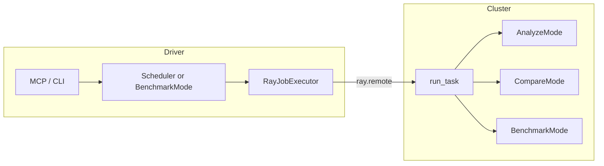

# Magpie on Ray

This document describes how [Ray](https://www.ray.io/) is integrated into Magpie so that **analyze**, **compare**, and **benchmark** workloads can run on **remote GPU nodes** instead of (or in addition to) the machine where you invoke the CLI or MCP.

It is a **reference manual** for operators and contributors. For Benchmark-mode diagrams and YAML examples, see [benchmark.md](benchmark.md). For kernel analyze vs compare semantics, see [analysis_compare.md](analysis_compare.md).

---

## 1. Goals and scope

- **Offload** compilation, correctness checks, profilers, and LLM serving to machines that actually have the GPUs and software stack you need.
- **Reuse the same mode code** (`AnalyzeMode`, `CompareMode`, `BenchmarkMode`) on the worker; Ray only changes **how** the task is launched (`RayJobExecutor` + `run_task` on a worker).
- **Rely on shared storage** (typically NFS) so Hugging Face caches, InferenceX checkouts, and benchmark artifacts are visible to both driver and workers.

Ray integration does **not** require the Ray Dashboard or Jobs API—only connectivity to the cluster (`ray.init` with `auto` or `ray://…`).

---

## 2. Prerequisites

| Requirement | Notes |
|-------------|--------|
| Python `ray` package on the **driver** | `pip install ray`; same major version as the cluster is recommended. |
| GPU **worker** nodes registered with Ray | Nodes expose `GPU` resources in `ray.nodes()`. |
| Magpie importable on workers | Default `RayConfig.install_magpie` is `true`: workers may install Magpie + `requirements.txt` via Ray `runtime_env["pip"]`. Pre-install Magpie in the image and set `install_magpie: false` to skip. |
| Shared filesystem (strongly recommended) | Same mount path on driver and workers for model cache, InferenceX, and benchmark results. |
| Kernel / project paths (analyze/compare) | Paths in YAML (e.g. `${CK_HOME}/…`) must exist **on the worker** (or on shared FS visible there). |

---

## 3. Architecture

### 3.1 Driver vs worker

- **Driver**: process running `python -m Magpie …`, MCP, or your script. It calls `Scheduler` or `BenchmarkMode`, connects with `ray.init(address=…)`, and submits a remote function.
- **Worker**: Ray executes `Magpie.remote.tasks.run_task` on a **GPU-capable node**. That function dispatches to `_run_analyze`, `_run_compare`, or `_run_benchmark`.

### 3.2 Executor selection

| `SchedulerConfig.environment_type` | Executor | Execution |
|-----------------------------------|----------|-----------|
| `local` | `LocalExecutor` | Subprocesses on the driver machine (`Magpie/core/executor.py`). |
| `container` | Container executor | Isolated environment on the driver (kernel flows). |
| `ray` | `RayJobExecutor` | `ray.remote(run_task)` on a cluster node (`Magpie/core/ray_executor.py`). |

Benchmark mode additionally uses `BenchmarkConfig.run_mode`: `docker`, `local`, or `ray`. When `run_mode` is `ray`, `BenchmarkMode` builds a `Task` and uses `RayJobExecutor` internally (`Magpie/modes/benchmark/benchmarker.py`).

### 3.3 End-to-end flow (conceptual)



---

## 4. Connecting to the cluster (`cluster_address`)

`RayConfig.cluster_address` (and the analyze/compare path: values taken from kernel YAML `ray_config.cluster_address` into `SchedulerConfig.ray_cluster_address`) is passed to `ray.init(address=…)`.

| Value | When to use |
|-------|-------------|
| `"auto"` | Driver runs **on the Ray head** or in the same Ray network namespace so the local GCS is discoverable. |
| IP/hostname of head (e.g. `"192.168.1.10:6379"`) | Explicit GCS address when `auto` is ambiguous. |
| `"ray://<host>:10001"` | Driver is **remote**; connect via **Ray Client** (typical client port `10001`). |

Using `auto` from a laptop that is **not** attached to the cluster will not reach remote workers—use `ray://…` or run the driver on the head node.

---

## 5. Shared storage

Default shared root in code: `DEFAULT_SHARED_STORAGE_PATH = "/shared_nfs/magpie"` (`Magpie/modes/benchmark/config.py`). Override with `shared_storage_path` in YAML.

### 5.1 What uses it

- **Worker env** (`Magpie/remote/tasks.py` `_setup_env`): sets `HF_HOME` and `TRANSFORMERS_CACHE` under `{shared_storage_path}/hf_cache` unless already set.
- **Benchmark on Ray** (`_run_benchmark`): if paths are empty, sets `inferencex_path` → `{shared_storage}/InferenceX`, `hf_cache_path` → `{shared_storage}/hf_cache`, and writes results under `{results_dir}/{task_id}` (defaults `results_dir` to `{shared_storage}/results`).

Analyze/compare do not rewrite kernel `working_dir` for you: **your YAML must point at directories the worker can access** (local disk or the same NFS mount).

### 5.2 Driver `runtime_env` and cache dirs

`RayJobExecutor._build_runtime_env` sets `HF_HOME` / `TRANSFORMERS_CACHE` from `RayConfig.hf_cache_dir` (derived from `shared_storage_path`) for the remote task environment, and optionally adds `pip` entries when `install_magpie` or `pip_packages` is set.

---

## 6. Analyze and compare on Ray

### 6.1 Enabling Ray for kernel modes

1. Add a top-level **`ray_config:`** block to the kernel YAML. `load_kernel_config` in `Magpie/main.py` sets `scheduler.environment` to **`ray`** when `ray_config` is present (unless overridden).
2. Or set **`scheduler.environment: ray`** in framework `config.yaml` / kernel YAML `scheduler:` and supply connection details (see below).

### 6.2 Fields read from kernel YAML into the scheduler

`_get_scheduler_config` maps:

- `ray_config.cluster_address` → `SchedulerConfig.ray_cluster_address`
- `ray_config.shared_storage_path` → `SchedulerConfig.ray_shared_storage_path`

The scheduler then constructs a **`RayConfig`** for `RayJobExecutor` with those fields (and **defaults** for all other `RayConfig` attributes such as `install_magpie`, `entrypoint_num_cpus`, `pip_packages`). Extra keys under kernel YAML `ray_config` are not merged into that executor `RayConfig` in the current implementation—treat comments in examples as **hints** for future alignment or for benchmark YAML where merging differs.

### 6.3 Overriding environment on the CLI

For any kernel config that implies Ray, you can force **local** execution:

```bash
python -m Magpie analyze --kernel-config examples/ck_gemm_add_ray.yaml -e local
```

Priority is **CLI `--environment` > kernel YAML > `Magpie/config.yaml` scheduler** (`Magpie/main.py` `_get_scheduler_config`).

### 6.4 Remote execution path

1. `run_analyze` / `run_compare` builds kernel configs and calls `scheduler.run_analyze` / `run_compare`.
2. `Scheduler` creates a `Task` with `ModeType.ANALYZE` or `COMPARE` and `executor.execute(task)`.
3. `RayJobExecutor._submit_ray_task` serializes `task.to_dict()` into `job_payload`, merges benchmark-only `ray_config` overrides if present (usually empty for kernel tasks), and calls `run_task.remote(job_payload)`.
4. On the worker, `run_task` runs `_run_analyze` or `_run_compare` (`Magpie/remote/tasks.py`)—same classes as locally.

**Result shape:** the driver receives a dict; `main.run_analyze` unwraps nested `results` when Ray returns `{"task_id", "results": [...]}`.

### 6.5 Example

See `examples/ck_gemm_add_ray.yaml`: `ray_config.cluster_address`, `shared_storage_path`, plus kernel paths using `${CK_HOME}` on the worker.

```bash
python -m Magpie analyze --kernel-config examples/ck_gemm_add_ray.yaml --no-perf
```

---

## 7. Benchmark on Ray

### 7.1 Configuration

In benchmark YAML set:

```yaml
benchmark:
  run_mode: ray
  ray_config:
    cluster_address: "auto"          # or ray://head:10001
    shared_storage_path: "/shared_nfs/magpie"
    entrypoint_num_cpus: 32
    install_magpie: false              # common when image already has Magpie
```

Full `RayConfig` fields are documented in `Magpie/modes/benchmark/config.py`. For `BenchmarkConfig`, `ray_config` is **required** when `run_mode` is `ray`.

### 7.2 Worker-side behavior

`_run_benchmark` (`Magpie/remote/tasks.py`):

1. Sets `run_mode` from `ray` to **`local`** so the worker runs `BenchmarkMode` **on that node** (Docker or local subprocess), not another Ray hop.
2. Fills default `inferencex_path` / `hf_cache_path` from `shared_storage_path` when omitted.
3. Sets `output_dir` to `{results_dir}/{task_id}` (defaults under shared storage).

The **driver** does not run vLLM/SGLang; it waits on `ray.get` and maps the returned dict into `BenchmarkResult` (`benchmarker._populate_result_from_ray`).

### 7.3 Tensor parallelism and multi-node hints

For **benchmark** payloads only, `run_task` calls `_configure_tp_isolation`:

- If `TP` ≤ GPUs on the current Ray node, it **clears `RAY_ADDRESS`** in the worker env and can append vLLM `--distributed-executor-backend mp` so the child uses local multiprocessing.
- If `TP` exceeds local GPUs, it **keeps `RAY_ADDRESS`** and can append vLLM `--distributed-executor-backend ray` or SGLang `--use-ray --nnodes N`.

Logic is in `Magpie/remote/tasks.py` (`_get_local_gpu_count`, `_configure_tp_isolation`). Tune `EXTRA_VLLM_ARGS` / `EXTRA_SGLANG_ARGS` in YAML if you need overrides.

### 7.4 Entry points on the driver

| Entry | Location | Behavior |
|-------|-----------|----------|
| CLI / MCP `benchmark` with YAML `run_mode: ray` | `BenchmarkMode.run()` | Creates `RayJobExecutor`, `execute(task)`, fills `BenchmarkResult`. |
| `Scheduler.run_benchmark_ray(...)` | `Magpie/core/scheduler.py` | Injects `run_mode: ray` and minimal `ray_config`, then **`BenchmarkMode.run()`** (same core path; helper for programmatic use). |

### 7.5 Example YAML

`examples/benchmarks/benchmark_vllm_dsr1_ray.yaml` shows a full vLLM benchmark targeting Ray with shared storage and `install_magpie: false`.

---

## 8. Scheduling, GPUs, and the outer `num_gpus=0` task

`RayJobExecutor._submit_ray_task` declares the remote function with **`num_gpus=0`** but pins it to a node that has GPUs using **`NodeAffinitySchedulingStrategy`** (`ray.util.scheduling_strategies`). `RayJobExecutor._find_gpu_node` prefers a **non-head** GPU worker when possible.

**Why `num_gpus=0`?** Frameworks such as vLLM may spawn their own Ray or multiprocessing workers and need to control `CUDA_VISIBLE_DEVICES` / `HIP_VISIBLE_DEVICES`. Reserving all GPUs on the outer task would conflict with that model.

After the task starts, `_clear_hidden_gpus` removes Ray-imposed **empty** visibility env vars so **child processes** see the node GPUs again (`Magpie/remote/tasks.py`).

---

## 9. Asynchronous benchmark submit (MCP / advanced)

`BenchmarkMode.submit_ray_benchmark(executor)` submits a Ray task **without** blocking; MCP and scripts can poll with the same `RayJobExecutor` instance. Related MCP tools (see `Magpie/mcp/server.py`):

- `ray_task_status` — running / succeeded / failed
- `ray_task_result` — cached result dict after completion
- `ray_task_cancel` — cancel an object ref
- `ray_task_list` — tracked task IDs

---

## 10. `RayConfig` reference

Defined in `Magpie/modes/benchmark/config.py` (`@dataclass RayConfig`).

| Field | Role |
|-------|------|
| `cluster_address` | `ray.init(address=…)` |
| `shared_storage_path` | Root for HF cache, InferenceX, results layout on workers |
| `entrypoint_num_cpus` | CPUs requested on the **outer** remote task |
| `entrypoint_num_gpus` | Declared on `RayConfig` but outer task uses `num_gpus=0` in code |
| `multi_node`, `total_num_gpus`, `num_nodes`, `gpus_per_node` | Used when building `runtime_env` (`RAY_ADDRESS`, `MAGPIE_TOTAL_GPUS`) for multi-node scenarios |
| `pip_packages` | Extra pip specs in `runtime_env` |
| `env_vars` | Extra env for remote task |
| `install_magpie` | If true, adds Magpie project + `requirements.txt` lines to `runtime_env["pip"]` |
| `magpie_install_path` | Override root used for editable Magpie install |

Derived helpers: `results_dir`, `hf_cache_dir`, `inferencex_dir`.

---

## 11. Troubleshooting

| Symptom | Things to check |
|---------|------------------|
| `ray.init` fails | Firewall, wrong address, Ray version mismatch; try `ray://host:10001` from remote drivers. |
| `No GPU node found in the Ray cluster` | Workers not started with GPUs; head-only cluster; GPU resources zero in `ray.nodes()`. |
| Analyze fails on worker: missing sources | `${CK_HOME}` or paths not on worker or NFS; build artifacts not present on worker. |
| Worker import errors for Magpie | Set `install_magpie: true` or bake Magpie into the worker image; check `runtime_env` pip logs. |
| Benchmark TP / Ray backend wrong | Inspect `_configure_tp_isolation` logs; set `EXTRA_VLLM_ARGS` / `EXTRA_SGLANG_ARGS` explicitly. |
| Empty GPU visibility in child | Should be fixed by `_clear_hidden_gpus`; if not, inspect env in InferenceX subprocess. |

---

## 12. Source map

| Area | File |
|------|------|
| CLI scheduler / kernel YAML Ray hints | `Magpie/main.py` (`load_kernel_config`, `_get_scheduler_config`) |
| Scheduler, `run_benchmark_ray` | `Magpie/core/scheduler.py` |
| `ray.init`, submit, wait, cancel, `runtime_env` | `Magpie/core/ray_executor.py` |
| Worker entry and mode runners | `Magpie/remote/tasks.py` |
| Benchmark Ray orchestration | `Magpie/modes/benchmark/benchmarker.py` |
| `BenchmarkConfig` / `RayConfig` | `Magpie/modes/benchmark/config.py` |
| MCP Ray task tools | `Magpie/mcp/server.py` |

---

## 13. Related material

- [benchmark.md](benchmark.md) — Benchmark mode, TraceLens, gap analysis, `run_mode` overview.
- [analysis_compare.md](analysis_compare.md) — Kernel analyze vs compare.
